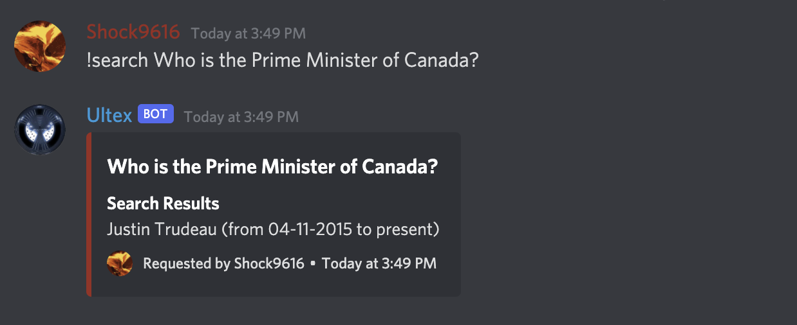
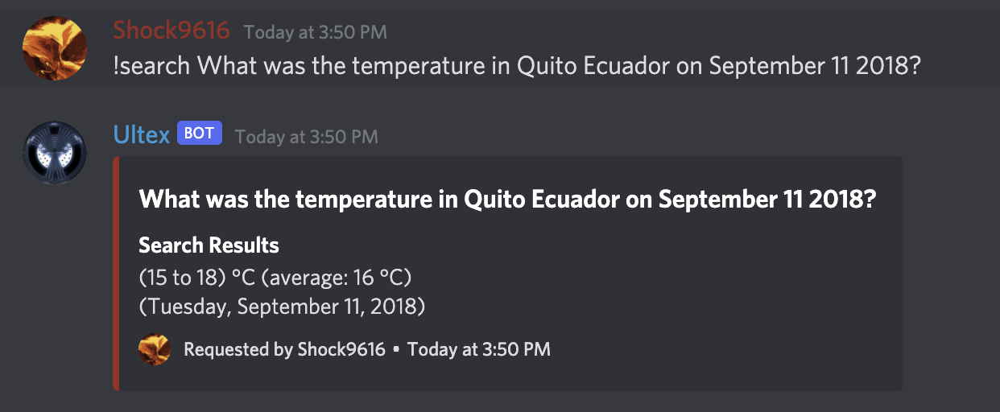

# Ultex

## Description

Ultex is a multi-purpose Discord bot with everything from music playback and moderation right down to a random number generator.

## Feature Highlights

* **Music playback** from YouTube complete with a queue, media controls, and in-built search functionality if you don't have the exact link to the song on YouTube!
* **Auto-invite**: Provide an/some email address(es), and an email will be sent to it/them with an invite link to your server!
* Advanced trivia searching capabilities. Just ask a question and an answer will be provided if possible! It could be anything from "Who is the current Prime Minister of Canada?" to "What was the temperature in Quito Ecuador on September 11 2018?"
* And much much more!

*Disclaimer: This bot is still a work in progress and as such, its other commands are not all fully implemented*

